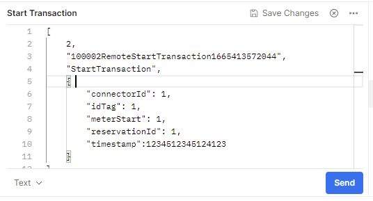

# Local DB + WebSockets/OCPP 101

## Requirements
- Backend repo
- Docker
- pgAdmin
- Postman

## How to connect to local database
1. Clone repo
2. Create an .env file and set USE_LOCAL_DATABASE = 1

## How to test server-side websockets
1. Run "docker-compose up"
2. Open pgAdmin and connect to the local database:
- `Host: 127.0.0.1`
- `Port: 5432`
- `Username: postgres`
- `Password: abc123`

3. Find the Charger table


4. Copy the serialNumber of the charger you want to test


5. Go to Postman
6. Create a new collection and choose Websocket Request (still in Beta)


7.  In Postman, enter the server URL in the following format and connect
`ws://localhost:1337/charger/YOUR_CHARGER_SERIAL_NUMBER`

Example:


## Testing
Web Sockets send and receive messages. With the OCPP protocol, this is how the backend communicates with the charger. To test that these messages are handled properly there are multiple methods:

## Automatic tests (console)
1. Set `RUN_OCPP_TEST = 1`
2. Check the console for results

## Automatic tests (API call)
1. Get the server IP (localhost:8080 or 18.202.253.30:8080)
2. Send an API call in the following format:
`http://SERVER_IP_HERE:8080/tests/ocpp`

## Manual testing
Manual testing requires the use of Postman to send messages. To send a message without errors, the process has to be initiated through the API.
To start, connect as a charger via Postman as the desired charger you want to act as.

### Good to know
- At index 0 in the array the number represent:
    - 3 = Response / Answering a request
    - 2 = Request
- Every socket conversation is initiated with a request from the server which is responded to by the charger. The conversation then ends with a request from the charger (and technically another response from the server).

### Example: Remote Start Transaction
(Starting a transaction is currently the same as starting a charging session)

1. Call StartTransaction through the API (in production this will be initiated by the GUI). Make sure that the transaction has the same connectorID as the connected charger socket (use pgAdmin to check transactions table, might need to manually insert a connectorID into a specific transaction).
`http://SERVER_IP_HERE:8080/transactions/start/TRANSACTION_ID_HERE`

2. Go to to the connecter charger socket, and get uniqueID from message at index 1


3. Send **Remote Start Transaction** response (with the uniqueID you got from the server)


4. Then immediately send **Start Transaction** request (still with the same uniqueID)



5. Check the confirmation from the server (the response from the API call should now also have come through.)


## Socket messages
Here are the socket messages that can be sent by the charger

**Reserve Now Response**
```json
[
    3,
    "UNIQUE_ID_HERE",
    "ReserveNow",
    {
        "status": "Accepted"
    }
]
```

**Remote Start Transaction Response**
```json
[
    3,
    "UNIQUE_ID_HERE",
    "RemoteStartTransaction",
    {
        "status": "Accepted"
    }
]
```

**Start Transaction Request**
```json
[
    2,
    "UNIQUE_ID_HERE",
    "StartTransaction",
    {
        "connectorId": 1,
        "idTag": 1,
        "meterStart": 1,
        "reservationId": 1,
        "timestamp":1664957184974
    }
]
```

**Remote Stop Transaction Response**
```json
[
    3,
    "UNIQUE_ID_HERE",
    "RemoteStopTransaction",
    {
        "status": "Accepted"
    }
]
```

**Stop Transaction Request**
```json
[
    2,
    "UNIQUE_ID_HERE",
    "StopTransaction",
    {
        "connectorId": 1,
        "idTag": 1,
        "meterStop": 1,
        "reservationId": 1,
        "transactionId": 1,
        "timestamp":1664957184974
    }
]

```

**Send Live Metrics**

This one requires a connected user client as well.
`ws://18.202.253.30:1337/user/USER_ID_HERE`
```json
[
    2,
    "uniqueID",
    "MeterValues",
    {
        "connectorId": 1,
        "transactionId": 1,
        "timestamp": 1664957184974,
        "values": {
            "chargingPercent": {
                "value": 0,
                "unit": "%",
                "measurand": "SoC"
            },
            "chargingPower": {
                "value": 0,
                "unit": "W",
                "measurand": "Power.Active.Import"
            },
            "chargedSoFar": {
                "value": 0,
                "unit": "Wh",
                "measurand": "Energy.Active.Import.Interval"
            }
        }
    }
]
```

**Changing charger status**

The status variable can be set to any of the following:
"Available",
"Preparing",
"Charging",
"SuspendedEVSE",
"SuspendedEV",
"Finishing",
"Reserved",
"Unavailable",
"Faulted",
This can be initiated directly by the charger (requires no API call).
```json
[
    2,
    "UNIQUE_ID",
    "StatusNotification",
    {
        "errorCode": "NoError",
        "status": "Available"
    }
]
```


